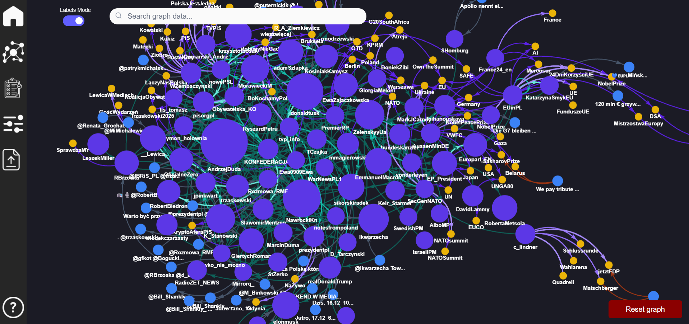
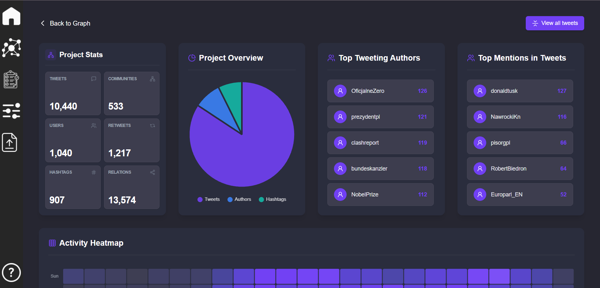

# Social Network Visualizer

**Engineering thesis** · Team of 3 · [AGH University of Science and Technology](https://www.agh.edu.pl/), Cracow · **2026**

## About the project

Social Network Visualizer is a full-stack web application for analyzing social media conversations as a **graph**. Instead of browsing raw JSON dumps or flat timelines, you load Twitter/X-style export files into a project and explore how **authors**, **tweets**, and **hashtags** connect to each other.

The system targets research-style exploration of online discourse: who influences whom, which posts spread, which hashtags bind communities together, and where the structural bridges in the network are. It turns social interaction data into an interactive analytical workspace - not a static chart, but a place to build a project, focus on a subgraph, run graph algorithms, and drill into metrics for specific users, posts, and hashtags.

---

## Features

- **Project ingest & management** - upload Twitter/X-style JSON exports, materialize them as a queryable Neo4j graph, and manage project files over time
- **Interactive graph explorer** - pan, zoom, search nodes, filter relation types, and expand the graph from selected nodes with context actions (mentions, replies, related hashtags, community membership, and more)
- **Workspaces** - save a focused analysis subgraph, return to it later, and export/import workspace state without rebuilding the exploration from scratch
- **Graph algorithms (Neo4j GDS)** - shortest paths between nodes (Dijkstra) and bridge detection on the live graph
- **Community & centrality** - community detection and PageRank to highlight cohesive groups and influential actors
- **Analytics dashboard** - project-level stats, activity over time, top hashtags, viral tweets, and leading authors/mentions
- **Entity drill-downs** - dedicated views for users, tweets, and hashtags (profiles, filtered tweet lists, activity charts, heatmaps, and related detail)

---

## Screenshots





---

## Demo & presentation

- **[Silent product demo (MP4)](https://github.com/TommyFurgi/social-network-visualizer/releases/download/portfolio-assets-v1/project-demo.mp4)** - no voiceover / narration
- **[Defense presentation (PDF)](https://github.com/TommyFurgi/social-network-visualizer/releases/download/portfolio-assets-v1/project-presentation.pdf)**
- Release page: [portfolio-assets-v1](https://github.com/TommyFurgi/social-network-visualizer/releases/tag/portfolio-assets-v1)

---

## Architecture

```text
┌─────────────┐      ┌──────────────────┐     ┌─────────────────────┐
│  Next.js    │────▶│  Spring Boot API │────▶│  Neo4j (+ GDS/APOC) │
│  frontend   │      │  (Java 21)       │     │  graph + algorithms │
└─────────────┘      └────────┬─────────┘     └─────────────────────┘
                             │
                             ▼
                    ┌──────────────────┐
                    │  MongoDB 6       │
                    │  project storage │
                    └──────────────────┘
```

| Layer | Stack |
|-------|--------|
| Frontend | Next.js 15, React 19, TypeScript, Tailwind CSS, force-graph |
| Backend | Spring Boot 3.4, Java 21 |
| Databases | Neo4j (Graph Data Science + APOC), MongoDB 6 |
| Infra | Docker Compose |

Everything runs via Docker Compose from the repository root.

---

## Authors

- [Tomasz Furgała](https://github.com/TommyFurgi)
- [Wiktor Dybalski](https://github.com/WiktorDybalski)
- [Piotr Śmiałek](https://github.com/daredevilq)

---

## My contribution

End-to-end ownership of data parsing, workspaces with related UI, and selected analytics algorithms:

- JSON project parser and loading (including Neo4j integrity constraints)
- Workspace logic and graph UI (search, node actions, dynamic expansion)
- Project analytics UI (metrics panel, tweet list)
- MongoDB setup; GDS Dijkstra and bridges; backend unit-test coverage
- Team coordination (supervisor contact, meetings, schedule)

---

## Requirements

- Docker and Docker Compose installed
- Docker Engine running

---

## Quick start

From the project root:

```bash
cd social-network-visualizer
```

Update the `.env` file with database credentials:

> **Note:** Neo4j requires a password of **at least 8 characters**. For MongoDB, 8+ characters is recommended.

```bash
# MongoDB
MONGO_HOST=mongodb
MONGO_PORT=27017
MONGO_DATABASE=socialdb
MONGO_USERNAME=root
MONGO_PASSWORD=
MONGO_AUTH_DB=admin

# Neo4j
NEO4J_URI=bolt://neo4j-database:7687
NEO4J_USERNAME=neo4j
NEO4J_PASSWORD=
NEO4J_AUTH="neo4j/${NEO4J_PASSWORD}"
```

> **Important:** If the app was previously started with different credentials, Docker volumes may still hold old database users/passwords. Updated `.env` values can then be ignored and authentication will fail. Reset with:

```bash
docker compose down -v --remove-orphans
```

Build and start all services:

```bash
docker compose up --build
```

Or, if images are already built:

```bash
docker compose up
```

### Access

- Frontend: http://localhost:3000
- Backend: http://localhost:8080

---

## Sample data

Example JSON projects for upload live in [`example-data/`](example-data/).

| Folder | Best for |
|--------|----------|
| `example-data/project2/` | **Quick start** - small multi-file sample |
| `example-data/project1/` | Medium single-file sample |
| `example-data/project3/`-`project5/` | Larger datasets (~20-33 MB each) |

---

## License

This project was created as an academic engineering thesis. Rights remain with the authors / university as applicable.
